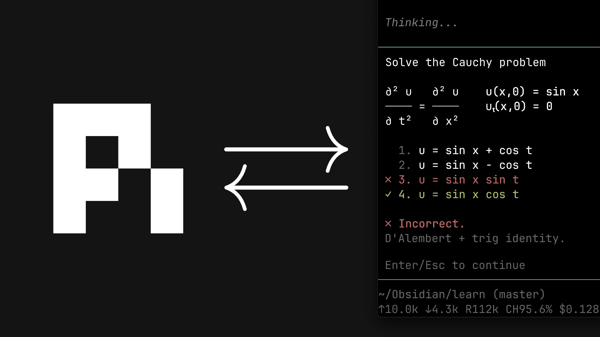

# learn

[](https://www.youtube.com/watch?v=kzcI5F4tGiU)

我的 AI 学习系统，来自这个视频：[How I Use AI to Learn Things](https://www.youtube.com/watch?v=kzcI5F4tGiU)。

这是我为自己构建的个人系统，按原样分享。它被构建成一个 pi 配置：教学哲学被编码进一个 skill，外加几个小扩展和子代理（agent）定义。

## 里面有什么

- `skills/teach/` —— 教学哲学与教学流程
- `skills/visualize/` —— 当一个想法用图表达更清晰时，给课程添加一张正确、极简的图示
- `extensions/ask-user-question/` —— 代理通过 UI 弹窗向你提问
- `extensions/quiz/` —— 带即时反馈的判分题（✓/✗、正确答案、解释）
- `extensions/md-log/` —— 把一个 markdown 文件关联到会话
- `extensions/visual-tools/` —— 供可视化子代理使用的工具
- `agents/` —— `researcher`、`svg-maker`、`mermaid-maker`：系统委派任务给这些子代理

## 安装

这个仓库本身**就是一个** `.pi` 目录。在你的学习项目根目录下执行：

```bash
git clone https://github.com/amosblomqvist/learn .pi
```

然后在该目录中打开 pi。（或者把你需要的部分复制到你现有的项目配置里。）

## 依赖

- [pi](https://github.com/earendil-works/pi)
- 一个子代理实现，这样系统才能派生出研究员和可视化制作者。推荐：[pi-interactive-subagents](https://github.com/amosblomqvist/pi-interactive-subagents)（仅限 tmux）。有了它，一切开箱即用。其他任何实现也能用，但可能需要适配子代理定义，例如 `agents/researcher.md` 在它的 tools 里列出了 `safe_bash`，这是那个扩展所特有的。
- `ask-user-question` —— 使用这里自带的那一份。如果你的环境里已经有一个 `ask-user-question` 扩展，请用**这一份**替换它。来自不同扩展的弹窗会通过一个共享 UI 锁来串行化，而这只有在它们是同一份实现时才有效。

## 说明

你可以在没有子代理的情况下运行这套系统。主会话负责教学。你只是会失去研究员（事实核实）和生成的图示。

这个教学 skill 是为一个学习者（我自己）写的。请编辑该 skill 以适配你自己的学习方式。
